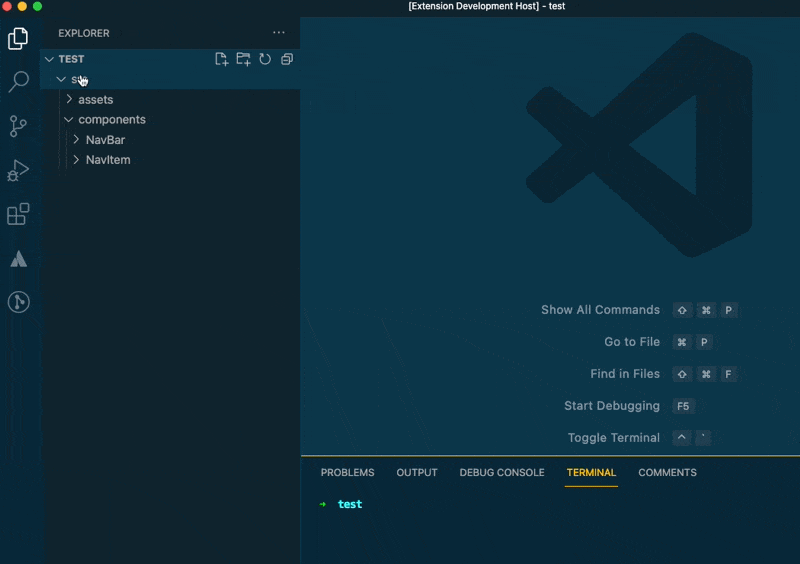

# Unqork Component Generator README

This extension lets you quickly generate a Typescript Component, CSS file, and test file after right-clicking on a folder.

## Usage

1. Right Click on any Folder in the Explorer and select `Create Unqork Component`
2. Choose if you want to add a `*.css` file added when generating the files. Hit `Enter` for Yes or select either option.
3. Then enter your Component name using TitleCase

## Known Issues

None yet!
